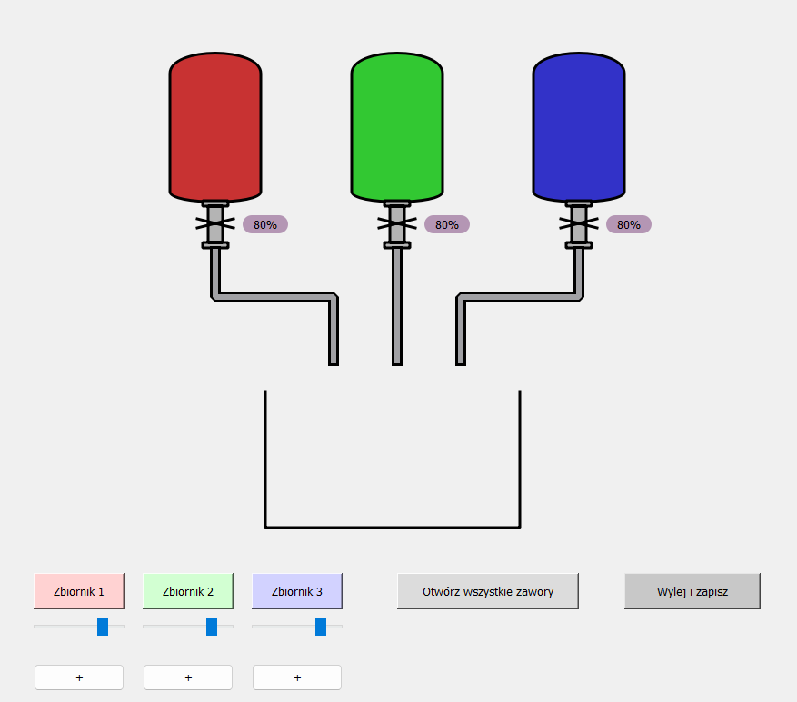

## Symulacja Przepływu Barwników

Projekt w Pythonie (PyQt5) symulujący przepływ trzech barwników (czerwony, zielony, niebieski) do dużego zbiornika z dynamicznym mieszaniem kolorów.

**Struktura kodu**

Kod projektu jest podzielony w czytelny sposób:

main.py – główny plik, w którym uruchamiana jest aplikacja.

Klasy pomocnicze – zarządzają logiką zbiorników, przepływem cieczy oraz historią wlewania.

Moduły GUI – odpowiadają za interfejs, wizualizację przepływu i interakcję użytkownika.

Dzięki takiej strukturze kod jest przejrzysty, łatwy w rozbudowie i utrzymaniu.

**Funkcjonalności**

Trzy małe zbiorniki barwników (czerwony, zielony, niebieski) z zaworami.

Duży zbiornik, który miesza kolory w proporcjach odpowiadających ilości dodanej cieczy.

Przepływ cieczy przez rury z wizualizacją w czasie rzeczywistym.

Suwaki do regulacji przepływu z każdego zbiornika.

Przyciski do ręcznego otwierania zaworów.

Przytrzymanie przycisku wlewa ciecz z wybranego zbiornika.

Przycisk do otwarcia lub zamknięcia wszystkich zaworów jednocześnie.

Możliwość uzupełnienia barwników do pełna przyciskiem “+”.

Wylewanie zawartości dużego zbiornika i zapis stanu do historii.

Raport w oknie dialogowym pokazujący historię wlewania barwników wraz z kolorem w postaci wizualnej.
